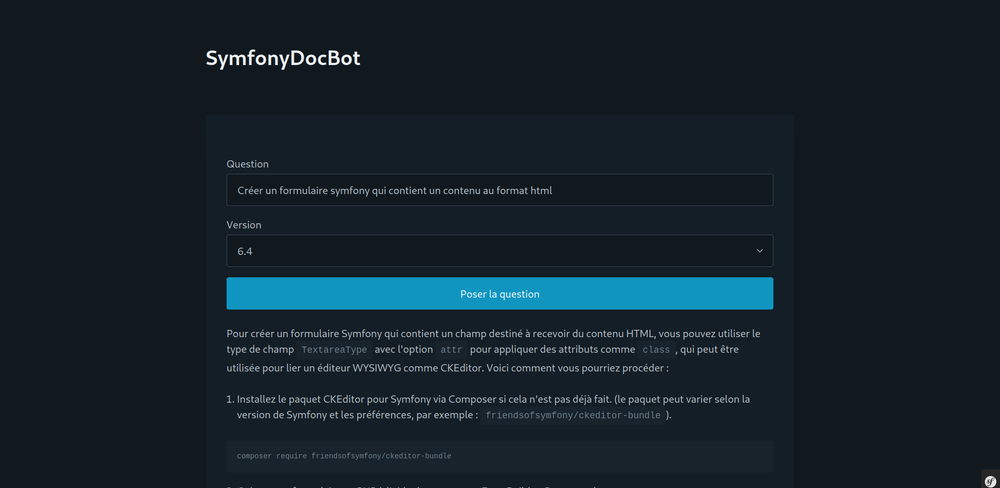

# Symfony Doc Bot

Symfony (6.4) chat bot based on [Yoandev article](https://yoandev.co/construire-un-rag-en-php-avec-la-doc-de-symfony-llphant-et-openai) and [Symfony doc](https://github.com/symfony/symfony-docs).

  

## Requirement

- Docker
- OpenAI API key

## Dependencies

- Php: 8.3
- [Symfony CLI](https://github.com/symfony-cli/symfony-cli/releases)
- [Composer 2](https://github.com/composer/composer/releases)
- PostgreSQL database

## Features

- Ask Symfony doc question
- Answer code display in md format
- Multiples Symfony versions
- Auto download Symfony doc (.rst files)

## How to install

Start the project with the following [doc file](doc/Start.md).

## Contribute

1. Run pre commit checks `make precommit`
2. Create Pull Request

## Contact

<contact@aymeric-cucherousset.fr>
